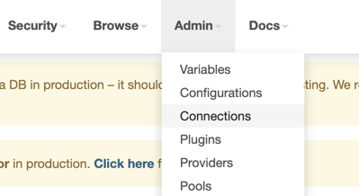
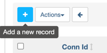
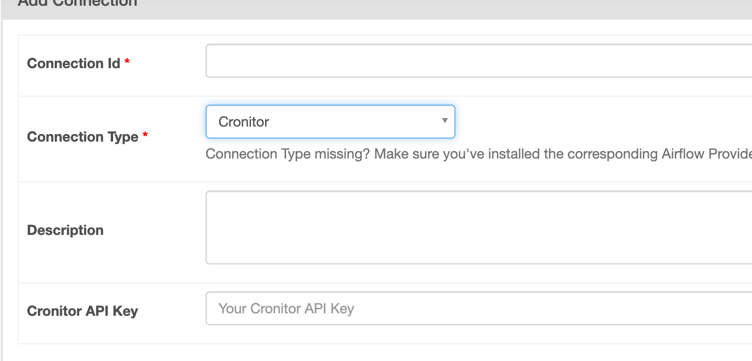

# cronitor-airflow
Cronitor integration for Airflow


## Setting up the Cronitor Airflow provider

### Installation
Install the package using pip:

```bash
pip install apache-airflow-providers-cronitor
```

### Create a connection
Then, you need to create an Airflow "Connection" to store your Cronitor API key. There are a number of ways you can do this, including storing the connection information using a [Secrets Backend](https://airflow.apache.org/docs/apache-airflow/stable/security/secrets/secrets-backend/index.html#configuration).

The simplest way to quickly create the connection is to use the Airflow UI:

 
Once you've selected "Connections", click "add a new record":



You will then see the "Add Connection" form. Select "Cronitor" as the connection type. It should be available as long as you have properly installed `apache-airflow-providers-cronitor` in your Airflow environment.



The best name for the connection is **cronitor_default**, following the default connection names for Airflow. This is the default Cronitor connection name used by the hook and operator.
Finally, add your API key, and save.

## Usage
### Use the Operator directly

With that, you are ready to use the operator. Using the operator directly is simple. To import the operator:

```python
from cronitor_airflow.operators.cronitor_operator import CronitorOperator
```

Please note that when setting the `monitor_id` from the Cronitor monitor you plan to ping, you must use the monitor's _key_, not the name.

For a full example of how to use the operator, take a look at this [sample DAG](examples/example_operator_dag.py) provided.

## Usage Notes
* When using the operator, `monitor_id` must be the key of your Cronitor monitor. You cannot use the monitor's name.
* Autodiscover does not currently support complex [timetables](https://airflow.apache.org/docs/apache-airflow/stable/concepts/timetable.html). Any timetable that cannot be generalized to a cron schedule will be ignored, and noted as such in the logs.